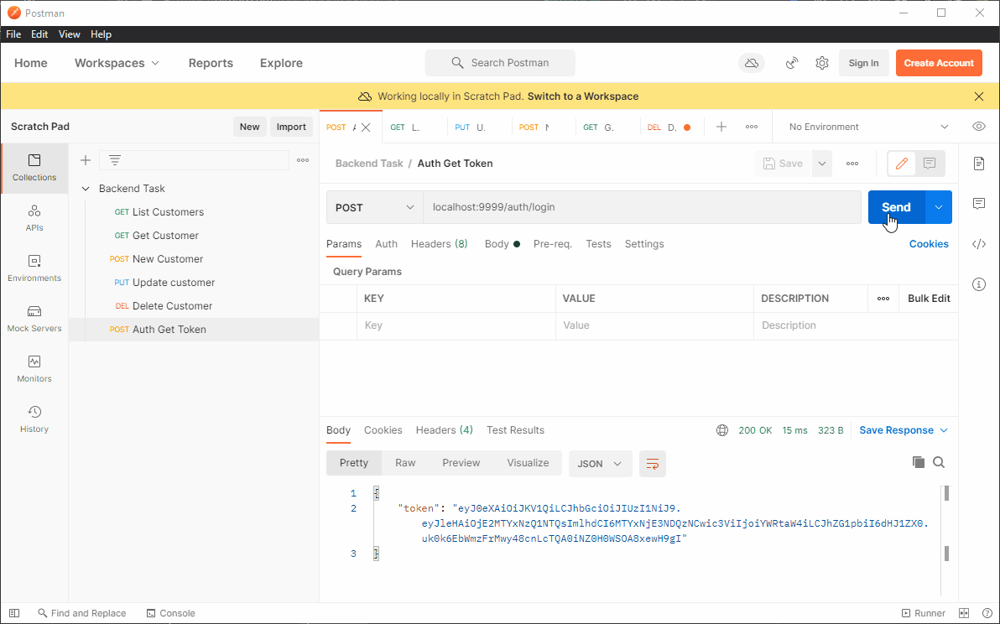

## Getting Started

```bash
docker-compose build
docker-compose up -d
```

- Server available at: <localhost:9999>
- pgAdmin available at: <localhost:5050>
- PostgreSQL available at: <localhost:5432> (docker network: `db`)

### Postman Collection

Import the file `Backend Task.postman_collection.json` into Postman for quick testing.

Auth using a hardcoded username and password is done via `/auth/login` and once you get the token, it is valid for 2
minutes.

Save the token as a global variable named `jwt_token`



## Routes

- /auth/login (POST)
    - Login with "admin", "admin"
- /api/customers (GET)
    - Get list of customer, query param n will return last n request
- /api/customers/ (POST)
    - Add new customer
- /api/customers/{int:customer_id} (GET)
    - Get a customer with id
- /api/customers/{int:customer_id} (PUT)
    - Update a customer with id
- /api/customers/{int:customer_id} (DELETE)
    - Delete a customer with id

## Blocking the Replaying of Old Sessions

Blocking a replay sessions is currently done via JWT's issued at (`iat`) field. As long as `iat` is expired, the session
token is not valid anymore. The only pitfall is that if the client-side device is compromised (a virus, MITM), then
there is no way of preventing a valid token from being replayed.